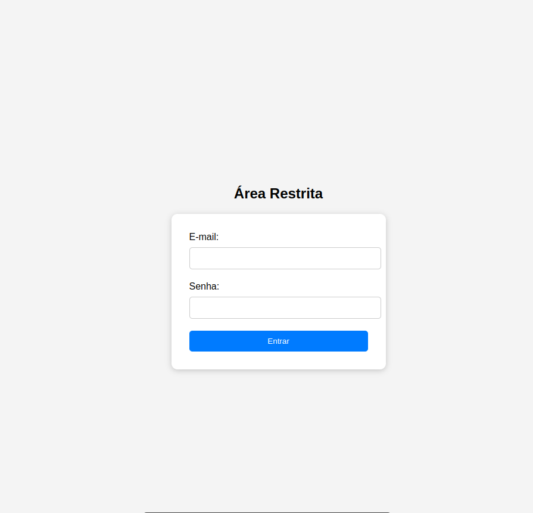

# 🎯 Simulador de Ataque Phishing com Python + Flask

Este projeto é um **simulador educativo de ataque phishing**, desenvolvido com **Python** e **Flask**, com fins exclusivamente didáticos e de conscientização em cibersegurança.

> ❗ **Atenção**: Este projeto é para **uso local e educacional**. Não deve ser usado para fins maliciosos ou em ambientes de produção. 

---

## 📌 Objetivo

Este simulador tem como objetivo demonstrar de forma prática:

- Como funcionam ataques de **phishing** (coleta de credenciais).
- Como dados podem ser capturados e analisados.
- A importância da **educação em segurança da informação**.


---

## ⚙️ Tecnologias Utilizadas

- Python 3.x 🐍
- Flask 🌐
- HTML + CSS (interface)
- CSV (armazenamento dos dados)
- Módulo `collections` e `datetime` para análise

---

## 🚀 Como Rodar o Projeto

### 1. Clone o repositório

```bash
git clone github.com:pkaarina/simulador_ataque_phishing.git
cd simulador_ataque_phishing
```
### 2. Crie e ative um ambiente virtual 

```bash
python -m venv venv
# Ativação:
# Windows:
venv\\Scripts\\activate
# macOS/Linux:
source venv/bin/activate
```
### 3.Instale as dependências

```bash
pip install flask
```
### 4. Rode o simulador
```bash
python app.py
```
Abra o navegador e acesse: http://127.0.0.1:5000

### 🖼️ Tela de Login Falsa

A interface simula uma área de login comum, solicitando e-mail e senha.

Exemplo visual da interface:
<p align="center">
   
</p>

### 📊 Análise dos Dados Capturados
Rode o script ```analysis.py``` para gerar um mini relatório com:

- Total de tentativas

- IPs únicos

- Último acesso

- IPs mais recorrentes

```bash
python analysis.py
```
### 🛡️ Aviso Ético
Este projeto é destinado exclusivamente para fins educacionais.
Nunca utilize este simulador em redes de terceiros, sem consentimento ou fora de ambientes controlados.

>💡 Use este conhecimento para defesa cibernética, testes autorizados e treinamentos de conscientização.

### 📚 Aprendizados Envolvidos
- Como funciona um ataque de engenharia social via phishing

- Manipulação de formulários HTML + Flask

- Captura e registro de dados (IP, hora, credenciais)

- Boas práticas de simulações controladas

- Geração de relatórios de análise

### 💻 Autoria
Desenvolvido por Karina ✨

Conecte-se comigo no [LinkedIn](https://www.linkedin.com/in/karina-raquel-oliveira-ferreira-a46497165/) para trocar ideias sobre cibersegurança!
